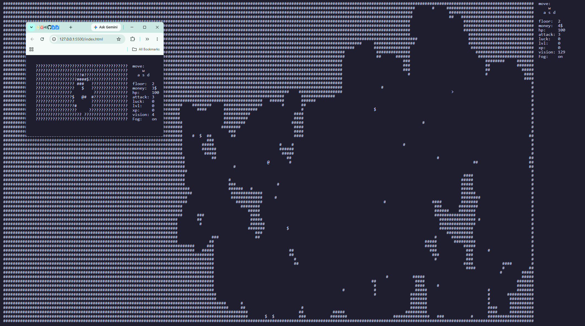
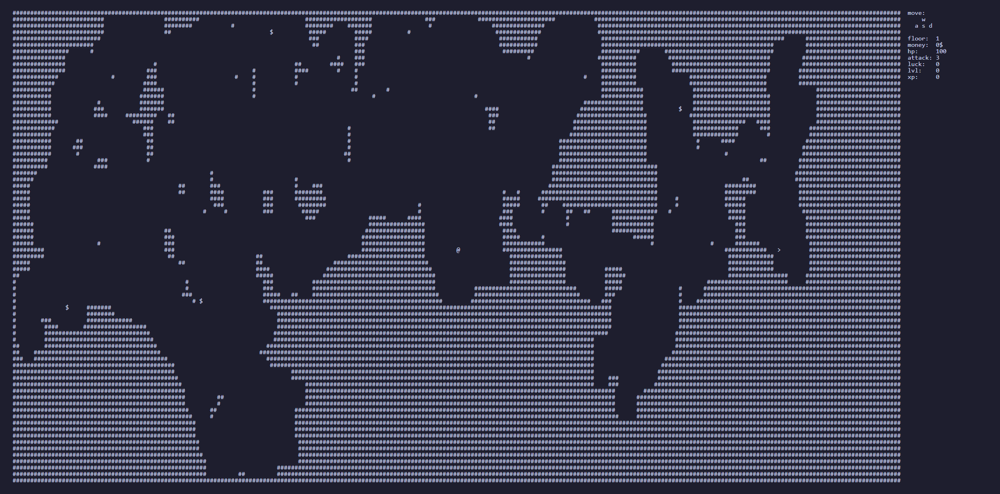

# tagless

a tagless html project, so 99.03% js.

completly text based, and is a gmae about exploring the world of text.

smallest window size is 22x22 in charters, and you can make it as big as you want.
or 600 x 440.
> Note: While though you can play with any screen size, 102x28 is the easiest, while smaller is more variented and bigger is just harder. 

> Note: have fun.

Classes:

- Dude - no buff
- healer - +15 hp per floor
- thief - +2 gold to all incomes
- fighter - x1.25 damage
- cat - +2 luck per level
- gambler - 35% 2x dmg, 50% x1, 15% x0
- apprentice - start with skill of choice (will be tripled)
- alchemist - x1.5 potion effect
- forgotten - +5 extra skill triggers and x2 dmg, no shop, no coins, no potions
- immortal - blocks damage equal to the floor number
- merchant - deal more damage with more money
- executor - attacks once at start of combat
- tank - blocks 5 damage in each combat
- vampire - heals after each combat
- robber - steals the cheapest item in the shop
- rich - starts with a free common item and 13 gold
- runner - +1 vision each floor
- guardian - more damage with more hp
- battle mage - potions have a 10% chance to give +1 attack
- mystic - gains a bonus every 7 levels and attack is increased by luck
- barbarian - x1.5 damage, -5 hp at start of floor
- trickster - +1 reroll token each floor, 10% to dodge attacks
- monk - all gold becomes xp, no shop
- greed - all xp becomes gold, no skills
- investor - gain 10% money on floor end.
- Deserter - fleeing gives xp, no money nor shop
- scavenger - potions give money, coins give hp
- bladesmith - +1 attack each lvl
- cyadian - max speed and sprint, sprint decreases each floor and gain +1 ttack each floor - cyadonia refrence
- gladiator - -50hp gain half of all dmg as coins

rankings:
Tier - Classeshttps://github.com/no10123/tagless/blob/main/README.md

S - broken     - immortal, alchemist, cat

A - verry good - merchant, vampire, runner

B - good       - guardian, executor, barbarian, tank, healer, thief, fighter, apprentice, rich, robber

C - ok         - gambler, battle mage

D - baseline   - Dude, mystic

E - challenge  - monk, greed, forgotten

Achievements:

- The beginning - get to floor 10 - 90.12%
- The Depths - get to floor 20 - 74.19%
- Endless? - get to floor 30 - 45.35%
- Beyond the end - get to floor 40 - 6.27%
- How? just how - get to floor 50 - 1.35%
- A dollar! - obtain 100 coins - 84.31%
- A band! - obtain 1000 coins - 47.50%
- Broke explorer - have 0 coins on floor 20 or greater - 0.96%
- First Death - die - 48.85%
- dual heart - have 200+ hp - 83.31%
- Five of hearts - have 500+ hp - 45.77%
- Imortality? - have 1000+ hp - 16.46%
- basic sword - have 25+ attack - 77.50%
- sharpened sword - have 50+ attack - 64.62%
- shiny sword - have 75+ attack - 51.31%
- legendary sword - have 100+ attack - 35.15%
- ascended sword - have 500+ attack - 0.27%
- god killer - have 1000+ attack - 0.00%
- Pure skill - have 0 luck on floor 20+ - 21.15%
- dice collector - have 5+ luck - 24.65%
- shiny penny - have 10+ luck - 7.85%
- lucky cat - have 20+ luck - 4.19%
- 4 leaf clover - have 40+ luck - 0.00%
- chosen fate - have 50+ luck - 0.00%
- basic adventurer - reach level 10+ - 67.08%
- intermediate adventurer - reach level 20+ - 2.35%
- advanced adventurer - reach level 30+ - 0.19%
- expert adventurer - reach level 40+ - 0.12%
- master adventurer - reach level 50+ - 0.04%
- grand master adventurer - reach level 100+ - 0.00%
- basic eyes - have 10+ vision - 4.08%
- platinum eye - have 20+ vision - 3.31%
- third eye - have 30+ vision - 2.08%
- Glasses! - have 50+ vision - 1.19%
- speedrunner - reach floor 20+ in under 5 minutes - 1.15%
- GOD mode - have 50+ vision, 50+ luck, level 100+, 1000+ attack, 1000+ hp, and 1000+ money - 0.00%
- SIX - SEVEN - have 67 attack, 67 hp, level 67, and 67 coins - 0.00%

> Credits: me - robopugo - no10123. - only took 29hrs to make. 

fun achivement I reached while working on the project, (num 2 in US for hackatime for past 7 days):

